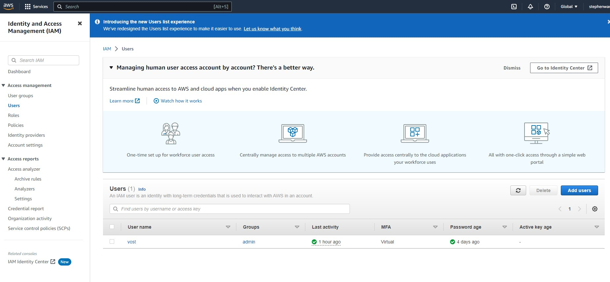
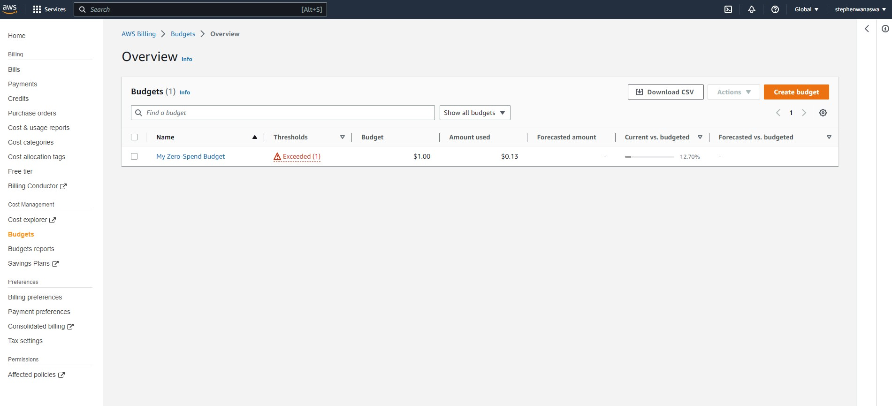

# Week 0 — Billing and Architecture
Started the week with watching the bootcamps live stream on youtube. 

## Homework Tasks

### Napkin Diagram
I was able to do a pen sketch of the cruddur app based on the pitch that was given 
Below is the image.


### Logical architectural diagram
I was able to recreate the architectural diagram on lucid with no challenges.
Image attached below


### Create an Admin User
Using the AWS root account I was able to create a second user account that has admin right. This account will be used to administrate the AWS organisation.


### Use CloudShell
On AWS page I was able to find the cloud CLI link and clicked on it. Using the tip from Andrew Brown's video I was able to use the code below to active the auto prompts to help with auto completing the commands.

```
aws --cli-auto-prompt

```


Went through a couple of command and read about the on the AWS documentation

### Installed AWS CLI
Using the gitpod button I launched gitpod cloud development platform. It launched on vscode. Using the vscode terminal I installed the AWS CLI using the commands below
```
curl "https://awscli.amazonaws.com/awscli-exe-linux-x86_64.zip" -o "awscliv2.zip"
unzip awscliv2.zip
sudo ./aws/install

```


I the used the credtial generated on the section below and verified my user account logged in

### Generate AWS Credentials
I needed a way to login to aws on Gitpod. I generated an api key to be used on gitpod. I successfuly exported them as environmental variables on gitpod to ease future logins


### Create a Billing Alarm
I used Chirag Nayyar Video [AWS Bootcamp Week 0](https://www.youtube.com/watch?v=OVw3RrlP-sI) to create the billing alarm


### Create a Budget
I created a zero limit budget and was able to get an alert when my usage went above that.



## Home Work Challenges
### Set MFA on both account
Multi factor authentication is active on all user account on my AWS


### AWS organisations
Created an Aws organisation for the bootcamp. This will be used for all the bootcamp projects


### AWS windows CLi
Installed aws cli on the windows machine


### Eventbridge Hookup
### Open Support Ticket on Service limits

## HomeWork Other
### Update Access Permissions for AWS Billing, Cost Management, and Account consoles
Got a notification on the billings page to update access permission for AWS Billing, Cost Management, and Account consoles. I read up on the update that Amazon is making to the Billings page and made the recommended changes.

### Security Considerations
Reviewed the data protection & residency in the security policy
Identity & access Management review
Check on the shared responsibility of threat detection


### Scrub sensitive data
