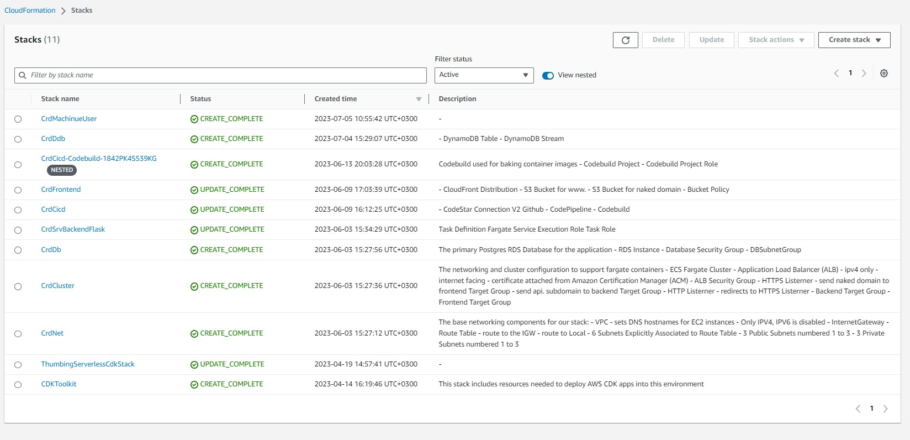

# Week 10 & 11 — CloudFormation Part 
## CloudFormation
This is an AWS service that enables on the define and deploy infrastructure resources in a declarative way.  We use CloudFormation templates to describe the infrastructure resources available in AWS. You can either use JSON or YAML to create the templates. We will use YAML in our case. 

The default format for the template is as below.

```
AWSTemplateFormatVersion: 2010-09-09
Description: |
    Setup ECS Cluster

Resources:
Parameters:
Mappings:
Resources:
Outputs:
Metadata
```

Once the templates are created we can deploy the using AWSCli. In our case we will create a script file to simplify the process.

CFN_PATH is where we will store our ``` template.yaml ``` file

We also use ```cfn-lint ``` to check our code for any errors and validate before deploying.


```
#! /usr/bin/env bash
set -e # stop the execution of the script if it fails

CFN_PATH="/workspace/aws-bootcamp-cruddur-2023/aws/cfn/template.yaml"
echo $CFN_PATH

cfn-lint $CFN_PATH

aws cloudformation deploy \
  --stack-name "my-cluster" \
  --s3-bucket "cfn-artifacts-$RANDOM_STRING" \
  --template-file "$CFN_PATH" \
  --no-execute-changeset \
  --capabilities CAPABILITY_NAMED_IAM

```

The --no-execute-changeset will review the changeset before we accept it.

The --capabilities CAPABILITY_NAMED_IAM get the permission required

Once the code is deployed we go to the Cloud formation console via the webUI and check on the changeset and review the changes being made ,deleted or created.

Below are the templates needed to create the infrastructures

## CFN Networking Layer

```   
AWSTemplateFormatVersion: 2010-09-09
Description: |
  The base networking components for our stack:
  - VPC
    - sets DNS hostnames for EC2 instances
    - Only IPV4, IPV6 is disabled
  - InternetGateway
  - Route Table
    - route to the IGW
    - route to Local
  - 6 Subnets Explicitly Associated to Route Table
    - 3 Public Subnets numbered 1 to 3
    - 3 Private Subnets numbered 1 to 3

Parameters:
  VpcCidrBlock:
    Type: String
    Default: 10.0.0.0/16
  Az1:
    Type: AWS::EC2::AvailabilityZone::Name
    Default: us-east-1a
  SubnetCidrBlocks: 
    Description: "Comma-delimited list of CIDR blocks for our private public subnets"
    Type: CommaDelimitedList
    Default: >
      10.0.0.0/24, 
      10.0.4.0/24, 
      10.0.8.0/24, 
      10.0.12.0/24,
      10.0.16.0/24,
      10.0.20.0/24
  Az2:
    Type: AWS::EC2::AvailabilityZone::Name
    Default: us-east-1b
  Az3:
    Type: AWS::EC2::AvailabilityZone::Name
    Default: us-east-1c
Resources:
  VPC:
    # https://docs.aws.amazon.com/AWSCloudFormation/latest/UserGuide/aws-resource-ec2-vpc.html
    Type: AWS::EC2::VPC
    Properties:
      CidrBlock: !Ref VpcCidrBlock
      EnableDnsHostnames: true
      EnableDnsSupport: true
      InstanceTenancy: default
      Tags:
        - Key: Name
          Value: !Sub "${AWS::StackName}VPC"
  IGW:
    # https://docs.aws.amazon.com/AWSCloudFormation/latest/UserGuide/aws-resource-ec2-internetgateway.html
    Type: AWS::EC2::InternetGateway
    Properties:
      Tags:
        - Key: Name
          Value: !Sub "${AWS::StackName}IGW"
  AttachIGW:
    Type: AWS::EC2::VPCGatewayAttachment
    Properties:
      VpcId: !Ref VPC
      InternetGatewayId: !Ref IGW
  RouteTable:
    # https://docs.aws.amazon.com/AWSCloudFormation/latest/UserGuide/aws-resource-ec2-routetable.html
    Type: AWS::EC2::RouteTable
    Properties:
      VpcId:  !Ref VPC
      Tags:
        - Key: Name
          Value: !Sub "${AWS::StackName}RT"
  RouteToIGW:
    # https://docs.aws.amazon.com/AWSCloudFormation/latest/UserGuide/aws-resource-ec2-route.html
    Type: AWS::EC2::Route
    DependsOn: AttachIGW
    Properties:
      RouteTableId: !Ref RouteTable
      GatewayId: !Ref IGW
      DestinationCidrBlock: 0.0.0.0/0
  SubnetPub1:
    # https://docs.aws.amazon.com/AWSCloudFormation/latest/UserGuide/aws-resource-ec2-subnet.html
    Type: AWS::EC2::Subnet
    Properties:
      AvailabilityZone: !Ref Az1
      CidrBlock: !Select [0, !Ref SubnetCidrBlocks]
      EnableDns64: false
      MapPublicIpOnLaunch: true #public subnet
      VpcId: !Ref VPC
      Tags:
        - Key: Name
          Value: !Sub "${AWS::StackName}SubnetPub1"
  SubnetPub2:
    # https://docs.aws.amazon.com/AWSCloudFormation/latest/UserGuide/aws-resource-ec2-subnet.html
    Type: AWS::EC2::Subnet
    Properties:
      AvailabilityZone: !Ref Az2
      CidrBlock: !Select [1, !Ref SubnetCidrBlocks]
      EnableDns64: false
      MapPublicIpOnLaunch: true #public subnet
      VpcId: !Ref VPC
      Tags:
        - Key: Name
          Value: !Sub "${AWS::StackName}SubnetPub2"
  SubnetPub3:
    # https://docs.aws.amazon.com/AWSCloudFormation/latest/UserGuide/aws-resource-ec2-subnet.html
    Type: AWS::EC2::Subnet
    Properties:
      AvailabilityZone: !Ref Az3
      CidrBlock: !Select [2, !Ref SubnetCidrBlocks]
      EnableDns64: false
      MapPublicIpOnLaunch: true #public subnet
      VpcId: !Ref VPC
      Tags:
        - Key: Name
          Value: !Sub "${AWS::StackName}SubnetPub3"
  SubnetPriv1:
    # https://docs.aws.amazon.com/AWSCloudFormation/latest/UserGuide/aws-resource-ec2-subnet.html
    Type: AWS::EC2::Subnet
    Properties:
      AvailabilityZone: !Ref Az1
      CidrBlock: !Select [3, !Ref SubnetCidrBlocks]
      EnableDns64: false
      MapPublicIpOnLaunch: false #public subnet
      VpcId: !Ref VPC
      Tags:
        - Key: Name
          Value: !Sub "${AWS::StackName}SubnetPriv1"
  SubnetPriv2:
    # https://docs.aws.amazon.com/AWSCloudFormation/latest/UserGuide/aws-resource-ec2-subnet.html
    Type: AWS::EC2::Subnet
    Properties:
      AvailabilityZone: !Ref Az2
      CidrBlock: !Select [4, !Ref SubnetCidrBlocks]
      EnableDns64: false
      MapPublicIpOnLaunch: false #public subnet
      VpcId: !Ref VPC
      Tags:
        - Key: Name
          Value: !Sub "${AWS::StackName}SubnetPriv2"
  SubnetPriv3:
    # https://docs.aws.amazon.com/AWSCloudFormation/latest/UserGuide/aws-resource-ec2-subnet.html
    Type: AWS::EC2::Subnet
    Properties:
      AvailabilityZone: !Ref Az3
      CidrBlock: !Select [5, !Ref SubnetCidrBlocks]
      EnableDns64: false
      MapPublicIpOnLaunch: false #public subnet
      VpcId: !Ref VPC
      Tags:
        - Key: Name
          Value: !Sub "${AWS::StackName}SubnetPriv3"
  SubnetPub1RTAssociation:
    Type: AWS::EC2::SubnetRouteTableAssociation
    Properties:
      SubnetId: !Ref SubnetPub1
      RouteTableId: !Ref RouteTable
  SubnetPub2RTAssociation:
    Type: AWS::EC2::SubnetRouteTableAssociation
    Properties:
      SubnetId: !Ref SubnetPub2
      RouteTableId: !Ref RouteTable
  SubnetPub3RTAssociation:
    Type: AWS::EC2::SubnetRouteTableAssociation
    Properties:
      SubnetId: !Ref SubnetPub3
      RouteTableId: !Ref RouteTable
  SubnetPriv1RTAssociation:
    Type: AWS::EC2::SubnetRouteTableAssociation
    Properties:
      SubnetId: !Ref SubnetPriv1
      RouteTableId: !Ref RouteTable
  SubnetPriv2RTAssociation:
    Type: AWS::EC2::SubnetRouteTableAssociation
    Properties:
      SubnetId: !Ref SubnetPriv2
      RouteTableId: !Ref RouteTable
  SubnetPriv3RTAssociation:
    Type: AWS::EC2::SubnetRouteTableAssociation
    Properties:
      SubnetId: !Ref SubnetPriv3
      RouteTableId: !Ref RouteTable
Outputs:
  VpcId:
    Value: !Ref VPC
    Export:
      Name: !Sub "${AWS::StackName}VpcId"
  VpcCidrBlock:
    Value: !GetAtt VPC.CidrBlock
    Export:
      Name: !Sub "${AWS::StackName}VpcCidrBlock"
  SubnetCidrBlocks:
    Value: !Join [",", !Ref SubnetCidrBlocks]
    Export:
      Name: !Sub "${AWS::StackName}SubnetCidrBlocks"
  PublicSubnetIds:
    Value: !Join 
      - ","
      - - !Ref SubnetPub1
        - !Ref SubnetPub2
        - !Ref SubnetPub3
    Export:
      Name: !Sub "${AWS::StackName}PublicSubnetIds"
  PrivateSubnetIds:
    Value: !Join 
      - ","
      - - !Ref SubnetPriv1
        - !Ref SubnetPriv2
        - !Ref SubnetPriv3
    Export:
      Name: !Sub "${AWS::StackName}PrivateSubnetIds"
  AvailabilityZones:
    Value: !Join 
      - ","
      - - !Ref Az1
        - !Ref Az2
        - !Ref Az3
    Export:
      Name: !Sub "${AWS::StackName}AvailabilityZones"

```

## CFN Cluster Layer

```   
AWSTemplateFormatVersion: 2010-09-09

Description: |
  The networking and cluster configuration to support fargate containers
  - ECS Fargate Cluster
  - Application Load Balancer (ALB)
    - ipv4 only
    - internet facing
    - certificate attached from Amazon Certification Manager (ACM)
  - ALB Security Group
  - HTTPS Listerner
    - send naked domain to frontend Target Group
    - send api. subdomain to backend Target Group
  - HTTP Listerner
    - redirects to HTTPS Listerner
  - Backend Target Group
  - Frontend Target Group

Parameters:
  NetworkingStack:
    Type: String
    Description: This is our base layer of networking components eg. VPC, Subnets
    Default: CrdNet
  CertificateArn:
    Type: String
  #Frontend ------
  FrontendPort:
    Type: Number
    Default: 3000
  FrontendHealthCheckIntervalSeconds:
    Type: Number
    Default: 15
  FrontendHealthCheckPath:
    Type: String
    Default: "/"
  FrontendHealthCheckPort:
    Type: String
    Default: 80
  FrontendHealthCheckProtocol:
    Type: String
    Default: HTTP
  FrontendHealthCheckTimeoutSeconds:
    Type: Number
    Default: 5
  FrontendHealthyThresholdCount:
    Type: Number
    Default: 2
  FrontendUnhealthyThresholdCount:
    Type: Number
    Default: 2
  #Backend ------
  BackendPort:
    Type: Number
    Default: 4567
  BackendHealthCheckIntervalSeconds:
    Type: String
    Default: 15
  BackendHealthCheckPath:
    Type: String
    Default: "/api/health-check"
  BackendHealthCheckPort:
    Type: String
    Default: 80
  BackendHealthCheckProtocol:
    Type: String
    Default: HTTP
  BackendHealthCheckTimeoutSeconds:
    Type: Number
    Default: 5
  BackendHealthyThresholdCount:
    Type: Number
    Default: 2
  BackendUnhealthyThresholdCount:
    Type: Number
    Default: 2
Resources:
  FargateCluster:
    # https://docs.aws.amazon.com/AWSCloudFormation/latest/UserGuide/aws-resource-ecs-cluster.html
    Type: AWS::ECS::Cluster
    Properties:
      ClusterName: !Sub "${AWS::StackName}FargateCluster"
      CapacityProviders:
        - FARGATE
      ClusterSettings:
        - Name: containerInsights
          Value: enabled
      Configuration:
        ExecuteCommandConfiguration:
          # KmsKeyId: !Ref KmsKeyId
          Logging: DEFAULT
      ServiceConnectDefaults:
        Namespace: cruddur
  ALB:
    # https://docs.aws.amazon.com/AWSCloudFormation/latest/UserGuide/aws-resource-elasticloadbalancingv2-loadbalancer.html
    Type: AWS::ElasticLoadBalancingV2::LoadBalancer
    Properties: 
      Name: !Sub "${AWS::StackName}ALB"
      Type: application
      IpAddressType: ipv4
      # https://docs.aws.amazon.com/AWSCloudFormation/latest/UserGuide/aws-properties-elasticloadbalancingv2-loadbalancer-loadbalancerattributes.html
      Scheme: internet-facing
      SecurityGroups:
        - !GetAtt ALBSG.GroupId
      Subnets:
        Fn::Split:
          - ","
          - Fn::ImportValue:
              !Sub "${NetworkingStack}PublicSubnetIds"
      LoadBalancerAttributes:
        - Key: routing.http2.enabled
          Value: true
        - Key: routing.http.preserve_host_header.enabled
          Value: false
        - Key: deletion_protection.enabled
          Value: true
        - Key: load_balancing.cross_zone.enabled
          Value: true
        - Key: access_logs.s3.enabled
          Value: false
        # In-case we want to turn on logs
        # - Name: access_logs.s3.bucket
        #   Value: bucket-name
        # - Name: access_logs.s3.prefix
        #   Value: ""
  HTTPSListener:
    # https://docs.aws.amazon.com/AWSCloudFormation/latest/UserGuide/aws-resource-elasticloadbalancingv2-listener.html
    Type: AWS::ElasticLoadBalancingV2::Listener
    Properties:
      Protocol: HTTPS
      Port: 443
      LoadBalancerArn: !Ref ALB
      Certificates: 
        - CertificateArn: !Ref CertificateArn
      DefaultActions:
        - Type: forward
          TargetGroupArn:  !Ref FrontendTG
  HTTPListener:
    # https://docs.aws.amazon.com/AWSCloudFormation/latest/UserGuide/aws-resource-elasticloadbalancingv2-listener.html
    Type: AWS::ElasticLoadBalancingV2::Listener
    Properties:
        Protocol: HTTP
        Port: 80
        LoadBalancerArn: !Ref ALB
        DefaultActions:
          - Type: redirect
            RedirectConfig:
              Protocol: "HTTPS"
              Port: 443
              Host: "#{host}"
              Path: "/#{path}"
              Query: "#{query}"
              StatusCode: "HTTP_301"
  ApiALBListernerRule:
    # https://docs.aws.amazon.com/AWSCloudFormation/latest/UserGuide/aws-resource-elasticloadbalancingv2-listenerrule.html
    Type: AWS::ElasticLoadBalancingV2::ListenerRule
    Properties:
      Conditions: 
        - Field: host-header
          HostHeaderConfig: 
            Values: 
              - api.bytetech.digital
      Actions: 
        - Type: forward
          TargetGroupArn:  !Ref BackendTG
      ListenerArn: !Ref HTTPSListener
      Priority: 1
  ALBSG:
    # https://docs.aws.amazon.com/AWSCloudFormation/latest/UserGuide/aws-properties-ec2-security-group.html
    Type: AWS::EC2::SecurityGroup
    Properties:
      GroupName: !Sub "${AWS::StackName}AlbSG"
      GroupDescription: Public Facing SG for our Cruddur ALB
      VpcId:
        Fn::ImportValue:
          !Sub ${NetworkingStack}VpcId
      SecurityGroupIngress:
        - IpProtocol: tcp
          FromPort: 443
          ToPort: 443
          CidrIp: '0.0.0.0/0'
          Description: INTERNET HTTPS
        - IpProtocol: tcp
          FromPort: 80
          ToPort: 80
          CidrIp: '0.0.0.0/0'
          Description: INTERNET HTTP
  # We have to create this SG before the service so we can pass it to database SG
  ServiceSG:
    # https://docs.aws.amazon.com/AWSCloudFormation/latest/UserGuide/aws-properties-ec2-security-group.html
    Type: AWS::EC2::SecurityGroup
    Properties:
      GroupName: !Sub "${AWS::StackName}ServSG"
      GroupDescription: Security for Fargate Services for Cruddur
      VpcId:
        Fn::ImportValue:
          !Sub ${NetworkingStack}VpcId
      SecurityGroupIngress:
        - IpProtocol: tcp
          SourceSecurityGroupId: !GetAtt ALBSG.GroupId
          FromPort: !Ref BackendPort
          ToPort: !Ref BackendPort
          Description: ALB HTTP
  BackendTG:
    # https://docs.aws.amazon.com/AWSCloudFormation/latest/UserGuide/aws-resource-elasticloadbalancingv2-targetgroup.html
    Type: AWS::ElasticLoadBalancingV2::TargetGroup
    Properties:
      #Name: !Sub "${AWS::StackName}BackendTG"
      Port: !Ref BackendPort
      HealthCheckEnabled: true
      HealthCheckProtocol: !Ref BackendHealthCheckProtocol
      HealthCheckIntervalSeconds: !Ref BackendHealthCheckIntervalSeconds
      HealthCheckPath: !Ref BackendHealthCheckPath
      HealthCheckPort: !Ref BackendHealthCheckPort
      HealthCheckTimeoutSeconds: !Ref BackendHealthCheckTimeoutSeconds
      HealthyThresholdCount: !Ref BackendHealthyThresholdCount
      UnhealthyThresholdCount: !Ref BackendUnhealthyThresholdCount
      IpAddressType: ipv4
      Matcher: 
        HttpCode: 200
      Protocol: HTTP
      ProtocolVersion: HTTP2
      TargetType: ip
      TargetGroupAttributes: 
        - Key: deregistration_delay.timeout_seconds
          Value: 0
      VpcId:
        Fn::ImportValue:
          !Sub ${NetworkingStack}VpcId
      Tags:
        - Key: target-group-name
          Value: backend
  FrontendTG:
    # https://docs.aws.amazon.com/AWSCloudFormation/latest/UserGuide/aws-resource-elasticloadbalancingv2-targetgroup.html
    Type: AWS::ElasticLoadBalancingV2::TargetGroup
    Properties:
      #Name: !Sub "${AWS::StackName}FrontendTG"
      Port: !Ref FrontendPort
      HealthCheckEnabled: true
      HealthCheckProtocol: !Ref FrontendHealthCheckProtocol
      HealthCheckIntervalSeconds: !Ref FrontendHealthCheckIntervalSeconds
      HealthCheckPath: !Ref FrontendHealthCheckPath
      HealthCheckPort: !Ref FrontendHealthCheckPort
      HealthCheckTimeoutSeconds: !Ref FrontendHealthCheckTimeoutSeconds
      HealthyThresholdCount: !Ref FrontendHealthyThresholdCount
      UnhealthyThresholdCount: !Ref FrontendUnhealthyThresholdCount
      IpAddressType: ipv4
      Matcher: 
        HttpCode: 200
      Protocol: HTTP
      ProtocolVersion: HTTP2
      TargetType: ip
      TargetGroupAttributes: 
        - Key: deregistration_delay.timeout_seconds
          Value: 0
      VpcId:
        Fn::ImportValue:
          !Sub ${NetworkingStack}VpcId
      Tags:
        - Key: target-group-name
          Value: frontend
Outputs:
  ClusterName:
    Value: !Ref FargateCluster
    Export:
      Name: !Sub "${AWS::StackName}ClusterName"
  ServiceSecurityGroupId:
    Value: !GetAtt ServiceSG.GroupId
    Export:
      Name: !Sub "${AWS::StackName}ServiceSecurityGroupId"
  ALBSecurityGroupId:
    Value: !GetAtt ALBSG.GroupId
    Export:
      Name: !Sub "${AWS::StackName}ALBSecurityGroupId"
  FrontendTGArn:
    Value: !Ref FrontendTG
    Export:
      Name: !Sub "${AWS::StackName}FrontendTGArn"
  BackendTGArn:
    Value: !Ref BackendTG
    Export:
      Name: !Sub "${AWS::StackName}BackendTGArn"

```
## CFN Toml
We use CFN toml tool to pass our Envirnmental variables to a CFN template.

We install it by running this command ``` gem install cfn-toml ```

[More info at Teacherseat github](https://github.com/teacherseat/cfn-toml)
```   
AWSTemplateFormatVersion: 2010-09-09
Description: |
  Task Definition
  Fargate Service
  Execution Role
  Task Role

Parameters:
  NetworkingStack:
    Type: String
    Description: This is our base layer of networking components eg. VPC, Subnets
    Default: CrdNet
  ClusterStack:
    Type: String
    Description: This is our cluster layer eg. ECS Cluster, ALB
    Default: CrdCluster
  ContainerPort:
    Type: Number
    Default: 4567
  ServiceCpu:
    Type: String
    Default: '256'
  ServiceMemory:
    Type: String
    Default: '512'
  ServiceName:
    Type: String
    Default: backend-flask
  ContainerName:
    Type: String
    Default: backend-flask
  TaskFamily:
    Type: String
    Default: backend-flask
  EcrImage:
    Type: String
    Default: '392067173187.dkr.ecr.us-east-1.amazonaws.com/backend-flask'
  EnvOtelServiceName:
    Type: String
    Default: backend-flask
  EnvOtelExporterOtlpEndpoint:
    Type: String
    Default: https://api.honeycomb.io
  EnvAWSCognitoUserPoolId:
    Type: String
    Default: us-east-1_ks7bIEUuu
  EnvCognitoUserPoolClientId:
    Type: String
    Default: 5747ng4l9dua3biio3n7cs94hg
  EnvFrontendUrl:
    Type: String
    Default: "*"
  EnvBackendUrl:
    Type: String
    Default: "*"
  SecretsAWSAccessKeyId:
    Type: String
    Default: 'arn:aws:ssm:us-east-1:392067173187:parameter/cruddur/backend-flask/AWS_ACCESS_KEY_ID'
  SecretsSecretAccessKey:
    Type: String
    Default: 'arn:aws:ssm:us-east-1:392067173187:parameter/cruddur/backend-flask/AWS_SECRET_ACCESS_KEY'
  SecretsConnectionUrl:
    Type: String
    Default: 'arn:aws:ssm:us-east-1:392067173187:parameter/cruddur/backend-flask/CONNECTION_URL'
  SecretsRollbarAccessToken:
    Type: String
    Default: 'arn:aws:ssm:us-east-1:392067173187:parameter/cruddur/backend-flask/ROLLBAR_ACCESS_TOKEN'
  SecretsOtelExporterOltpHeaders:
    Type: String
    Default: 'arn:aws:ssm:us-east-1:392067173187:parameter/cruddur/backend-flask/OTEL_EXPORTER_OTLP_HEADERS'
  DDBMessageTable:
    Type: String
    Default: cruddur-messages

Resources:
  FargateService:
  # https://docs.aws.amazon.com/AWSCloudFormation/latest/UserGuide/aws-resource-ecs-service.html
    Type: AWS::ECS::Service
    Properties:
      Cluster:
        Fn::ImportValue:
          !Sub "${ClusterStack}ClusterName"
      DeploymentController:
        Type: ECS
      DesiredCount: 1
      EnableECSManagedTags: true
      EnableExecuteCommand: true
      HealthCheckGracePeriodSeconds: 0
      LaunchType: FARGATE
      LoadBalancers:
        - TargetGroupArn:
            Fn::ImportValue:
              !Sub "${ClusterStack}BackendTGArn"
          ContainerName: 'backend-flask'
          ContainerPort: !Ref ContainerPort
      NetworkConfiguration:
        AwsvpcConfiguration:
          AssignPublicIp: ENABLED
          SecurityGroups:
            - Fn::ImportValue:
                !Sub "${ClusterStack}ServiceSecurityGroupId"
          Subnets:
            Fn::Split:
              - ","
              - Fn::ImportValue:
                  !Sub "${NetworkingStack}PublicSubnetIds"
      PlatformVersion: LATEST
      PropagateTags: SERVICE
      ServiceConnectConfiguration:
        Enabled: true
        Namespace: "cruddur"
        # Optional TODO - If you want to log
        # LogConfiguration
        Services:
          - DiscoveryName: backend-flask
            PortName: backend-flask
            ClientAliases:
              - Port: !Ref ContainerPort
      #ServiceRegistries:
      #  - RegistryArn: !Sub 'arn:aws:servicediscovery:${AWS::Region}:${AWS::AccountId}:service/srv-cruddur-backend-flask'
      #    Port: !Ref ContainerPort
      #    ContainerName: 'backend-flask'
      #    ContainerPort: !Ref ContainerPort
      ServiceName: !Ref ServiceName
      TaskDefinition: !Ref TaskDefinition

  TaskDefinition:
    # https://docs.aws.amazon.com/AWSCloudFormation/latest/UserGuide/aws-resource-ecs-taskdefinition.html
    Type: 'AWS::ECS::TaskDefinition'
    Properties:
      Family: !Ref TaskFamily
      ExecutionRoleArn: !GetAtt ExecutionRole.Arn
      TaskRoleArn: !GetAtt TaskRole.Arn
      NetworkMode: 'awsvpc'
      Cpu: !Ref ServiceCpu
      Memory: !Ref ServiceMemory
      RequiresCompatibilities:
        - 'FARGATE'
      ContainerDefinitions:
        - Name: 'xray'
          Image: 'public.ecr.aws/xray/aws-xray-daemon'
          Essential: true
          User: '1337'
          PortMappings:
            - Name: 'xray'
              ContainerPort: 2000
              Protocol: 'udp'
        - Name: 'backend-flask'
          Image: !Ref EcrImage 
          Essential: true
          HealthCheck:
            Command:
              - 'CMD-SHELL'
              - 'python /backend-flask/bin/health-check'
            Interval: 30
            Timeout: 5
            Retries: 3
            StartPeriod: 60
          PortMappings:
            - Name: !Ref ContainerName
              ContainerPort: !Ref ContainerPort
              Protocol: 'tcp'
              AppProtocol: 'http'
          LogConfiguration:
            LogDriver: 'awslogs'
            Options:
              awslogs-group: 'cruddur'
              awslogs-region: !Ref AWS::Region
              awslogs-stream-prefix: !Ref ServiceName
          Environment:
            - Name: 'DDB_MESSAGE_TABLE'
              Value: !Ref DDBMessageTable
            - Name: 'OTEL_SERVICE_NAME'
              Value: !Ref EnvOtelServiceName
            - Name: 'OTEL_EXPORTER_OTLP_ENDPOINT'
              Value: !Ref EnvOtelExporterOtlpEndpoint
            - Name: 'AWS_COGNITO_USER_POOL_ID'
              Value: !Ref EnvAWSCognitoUserPoolId
            - Name: 'AWS_COGNITO_USER_POOL_CLIENT_ID'
              Value: !Ref EnvCognitoUserPoolClientId
            - Name: 'FRONTEND_URL'
              Value: !Ref EnvFrontendUrl
            - Name: 'BACKEND_URL'
              Value: !Ref EnvBackendUrl
            - Name: 'AWS_DEFAULT_REGION'
              Value: !Ref AWS::Region
          Secrets:
            - Name: 'AWS_ACCESS_KEY_ID'
              ValueFrom: !Ref SecretsAWSAccessKeyId
            - Name: 'AWS_SECRET_ACCESS_KEY'
              ValueFrom: !Ref SecretsSecretAccessKey
            - Name: 'CONNECTION_URL'
              ValueFrom: !Ref SecretsConnectionUrl
            - Name: 'ROLLBAR_ACCESS_TOKEN'
              ValueFrom: !Ref SecretsRollbarAccessToken
            - Name: 'OTEL_EXPORTER_OTLP_HEADERS'
              ValueFrom: !Ref SecretsOtelExporterOltpHeaders
  ExecutionRole:
    # https://docs.aws.amazon.com/AWSCloudFormation/latest/UserGuide/aws-resource-iam-role.html
    Type: AWS::IAM::Role
    Properties:
      RoleName: CruddurServiceExecutionRole
      AssumeRolePolicyDocument:
        Version: '2012-10-17'
        Statement:
          - Effect: 'Allow'
            Principal:
              Service: 'ecs-tasks.amazonaws.com'
            Action: 'sts:AssumeRole'
      Policies:
        - PolicyName: 'cruddur-execution-policy'
          PolicyDocument:
            Version: '2012-10-17'
            Statement:
              - Sid: 'VisualEditor0'
                Effect: 'Allow'
                Action:
                  - 'ecr:GetAuthorizationToken'
                  - 'ecr:BatchCheckLayerAvailability'
                  - 'ecr:GetDownloadUrlForLayer'
                  - 'ecr:BatchGetImage'
                  - 'logs:CreateLogStream'
                  - 'logs:PutLogEvents'
                Resource: '*'
              - Sid: 'VisualEditor1'
                Effect: 'Allow'
                Action:
                  - 'ssm:GetParameters'
                  - 'ssm:GetParameter'
                Resource: !Sub 'arn:aws:ssm:${AWS::Region}:${AWS::AccountId}:parameter/cruddur/${ServiceName}/*'
      ManagedPolicyArns:
        - arn:aws:iam::aws:policy/CloudWatchLogsFullAccess
  TaskRole:
    # https://docs.aws.amazon.com/AWSCloudFormation/latest/UserGuide/aws-resource-iam-role.html
    Type: AWS::IAM::Role
    Properties:
      RoleName: CruddurServiceTaskRole
      AssumeRolePolicyDocument:
        Version: '2012-10-17'
        Statement:
          - Effect: 'Allow'
            Principal:
              Service: 'ecs-tasks.amazonaws.com'
            Action: 'sts:AssumeRole'
      Policies:
        - PolicyName: 'cruddur-task-policy'
          PolicyDocument:
            Version: '2012-10-17'
            Statement:
              - Sid: 'VisualEditor0'
                Effect: 'Allow'
                Action:
                  - ssmmessages:CreateControlChannel
                  - ssmmessages:CreateDataChannel
                  - ssmmessages:OpenControlChannel
                  - ssmmessages:OpenDataChannel
                Resource: '*'
      ManagedPolicyArns:
        - arn:aws:iam::aws:policy/CloudWatchLogsFullAccess
        - arn:aws:iam::aws:policy/AWSXRayDaemonWriteAccess
Outputs:
  ServiceName:
    Value: !GetAtt FargateService.Name
    Export:
      Name: !Sub "${AWS::StackName}ServiceName"

```
## CFN Service Layer for Backend

```   
AWSTemplateFormatVersion: 2010-09-09
Description: |
  Task Definition
  Fargate Service
  Execution Role
  Task Role

Parameters:
  NetworkingStack:
    Type: String
    Description: This is our base layer of networking components eg. VPC, Subnets
    Default: CrdNet
  ClusterStack:
    Type: String
    Description: This is our cluster layer eg. ECS Cluster, ALB
    Default: CrdCluster
  ContainerPort:
    Type: Number
    Default: 4567
  ServiceCpu:
    Type: String
    Default: '256'
  ServiceMemory:
    Type: String
    Default: '512'
  ServiceName:
    Type: String
    Default: backend-flask
  ContainerName:
    Type: String
    Default: backend-flask
  TaskFamily:
    Type: String
    Default: backend-flask
  EcrImage:
    Type: String
    Default: '392067173187.dkr.ecr.us-east-1.amazonaws.com/backend-flask'
  EnvOtelServiceName:
    Type: String
    Default: backend-flask
  EnvOtelExporterOtlpEndpoint:
    Type: String
    Default: https://api.honeycomb.io
  EnvAWSCognitoUserPoolId:
    Type: String
    Default: us-east-1_ks7bIEUuu
  EnvCognitoUserPoolClientId:
    Type: String
    Default: 5747ng4l9dua3biio3n7cs94hg
  EnvFrontendUrl:
    Type: String
    Default: "*"
  EnvBackendUrl:
    Type: String
    Default: "*"
  SecretsAWSAccessKeyId:
    Type: String
    Default: 'arn:aws:ssm:us-east-1:392067173187:parameter/cruddur/backend-flask/AWS_ACCESS_KEY_ID'
  SecretsSecretAccessKey:
    Type: String
    Default: 'arn:aws:ssm:us-east-1:392067173187:parameter/cruddur/backend-flask/AWS_SECRET_ACCESS_KEY'
  SecretsConnectionUrl:
    Type: String
    Default: 'arn:aws:ssm:us-east-1:392067173187:parameter/cruddur/backend-flask/CONNECTION_URL'
  SecretsRollbarAccessToken:
    Type: String
    Default: 'arn:aws:ssm:us-east-1:392067173187:parameter/cruddur/backend-flask/ROLLBAR_ACCESS_TOKEN'
  SecretsOtelExporterOltpHeaders:
    Type: String
    Default: 'arn:aws:ssm:us-east-1:392067173187:parameter/cruddur/backend-flask/OTEL_EXPORTER_OTLP_HEADERS'
  DDBMessageTable:
    Type: String
    Default: cruddur-messages

Resources:
  FargateService:
  # https://docs.aws.amazon.com/AWSCloudFormation/latest/UserGuide/aws-resource-ecs-service.html
    Type: AWS::ECS::Service
    Properties:
      Cluster:
        Fn::ImportValue:
          !Sub "${ClusterStack}ClusterName"
      DeploymentController:
        Type: ECS
      DesiredCount: 1
      EnableECSManagedTags: true
      EnableExecuteCommand: true
      HealthCheckGracePeriodSeconds: 0
      LaunchType: FARGATE
      LoadBalancers:
        - TargetGroupArn:
            Fn::ImportValue:
              !Sub "${ClusterStack}BackendTGArn"
          ContainerName: 'backend-flask'
          ContainerPort: !Ref ContainerPort
      NetworkConfiguration:
        AwsvpcConfiguration:
          AssignPublicIp: ENABLED
          SecurityGroups:
            - Fn::ImportValue:
                !Sub "${ClusterStack}ServiceSecurityGroupId"
          Subnets:
            Fn::Split:
              - ","
              - Fn::ImportValue:
                  !Sub "${NetworkingStack}PublicSubnetIds"
      PlatformVersion: LATEST
      PropagateTags: SERVICE
      ServiceConnectConfiguration:
        Enabled: true
        Namespace: "cruddur"
        # Optional TODO - If you want to log
        # LogConfiguration
        Services:
          - DiscoveryName: backend-flask
            PortName: backend-flask
            ClientAliases:
              - Port: !Ref ContainerPort
      #ServiceRegistries:
      #  - RegistryArn: !Sub 'arn:aws:servicediscovery:${AWS::Region}:${AWS::AccountId}:service/srv-cruddur-backend-flask'
      #    Port: !Ref ContainerPort
      #    ContainerName: 'backend-flask'
      #    ContainerPort: !Ref ContainerPort
      ServiceName: !Ref ServiceName
      TaskDefinition: !Ref TaskDefinition

  TaskDefinition:
    # https://docs.aws.amazon.com/AWSCloudFormation/latest/UserGuide/aws-resource-ecs-taskdefinition.html
    Type: 'AWS::ECS::TaskDefinition'
    Properties:
      Family: !Ref TaskFamily
      ExecutionRoleArn: !GetAtt ExecutionRole.Arn
      TaskRoleArn: !GetAtt TaskRole.Arn
      NetworkMode: 'awsvpc'
      Cpu: !Ref ServiceCpu
      Memory: !Ref ServiceMemory
      RequiresCompatibilities:
        - 'FARGATE'
      ContainerDefinitions:
        - Name: 'xray'
          Image: 'public.ecr.aws/xray/aws-xray-daemon'
          Essential: true
          User: '1337'
          PortMappings:
            - Name: 'xray'
              ContainerPort: 2000
              Protocol: 'udp'
        - Name: 'backend-flask'
          Image: !Ref EcrImage 
          Essential: true
          HealthCheck:
            Command:
              - 'CMD-SHELL'
              - 'python /backend-flask/bin/health-check'
            Interval: 30
            Timeout: 5
            Retries: 3
            StartPeriod: 60
          PortMappings:
            - Name: !Ref ContainerName
              ContainerPort: !Ref ContainerPort
              Protocol: 'tcp'
              AppProtocol: 'http'
          LogConfiguration:
            LogDriver: 'awslogs'
            Options:
              awslogs-group: 'cruddur'
              awslogs-region: !Ref AWS::Region
              awslogs-stream-prefix: !Ref ServiceName
          Environment:
            - Name: 'DDB_MESSAGE_TABLE'
              Value: !Ref DDBMessageTable
            - Name: 'OTEL_SERVICE_NAME'
              Value: !Ref EnvOtelServiceName
            - Name: 'OTEL_EXPORTER_OTLP_ENDPOINT'
              Value: !Ref EnvOtelExporterOtlpEndpoint
            - Name: 'AWS_COGNITO_USER_POOL_ID'
              Value: !Ref EnvAWSCognitoUserPoolId
            - Name: 'AWS_COGNITO_USER_POOL_CLIENT_ID'
              Value: !Ref EnvCognitoUserPoolClientId
            - Name: 'FRONTEND_URL'
              Value: !Ref EnvFrontendUrl
            - Name: 'BACKEND_URL'
              Value: !Ref EnvBackendUrl
            - Name: 'AWS_DEFAULT_REGION'
              Value: !Ref AWS::Region
          Secrets:
            - Name: 'AWS_ACCESS_KEY_ID'
              ValueFrom: !Ref SecretsAWSAccessKeyId
            - Name: 'AWS_SECRET_ACCESS_KEY'
              ValueFrom: !Ref SecretsSecretAccessKey
            - Name: 'CONNECTION_URL'
              ValueFrom: !Ref SecretsConnectionUrl
            - Name: 'ROLLBAR_ACCESS_TOKEN'
              ValueFrom: !Ref SecretsRollbarAccessToken
            - Name: 'OTEL_EXPORTER_OTLP_HEADERS'
              ValueFrom: !Ref SecretsOtelExporterOltpHeaders
  ExecutionRole:
    # https://docs.aws.amazon.com/AWSCloudFormation/latest/UserGuide/aws-resource-iam-role.html
    Type: AWS::IAM::Role
    Properties:
      RoleName: CruddurServiceExecutionRole
      AssumeRolePolicyDocument:
        Version: '2012-10-17'
        Statement:
          - Effect: 'Allow'
            Principal:
              Service: 'ecs-tasks.amazonaws.com'
            Action: 'sts:AssumeRole'
      Policies:
        - PolicyName: 'cruddur-execution-policy'
          PolicyDocument:
            Version: '2012-10-17'
            Statement:
              - Sid: 'VisualEditor0'
                Effect: 'Allow'
                Action:
                  - 'ecr:GetAuthorizationToken'
                  - 'ecr:BatchCheckLayerAvailability'
                  - 'ecr:GetDownloadUrlForLayer'
                  - 'ecr:BatchGetImage'
                  - 'logs:CreateLogStream'
                  - 'logs:PutLogEvents'
                Resource: '*'
              - Sid: 'VisualEditor1'
                Effect: 'Allow'
                Action:
                  - 'ssm:GetParameters'
                  - 'ssm:GetParameter'
                Resource: !Sub 'arn:aws:ssm:${AWS::Region}:${AWS::AccountId}:parameter/cruddur/${ServiceName}/*'
      ManagedPolicyArns:
        - arn:aws:iam::aws:policy/CloudWatchLogsFullAccess
  TaskRole:
    # https://docs.aws.amazon.com/AWSCloudFormation/latest/UserGuide/aws-resource-iam-role.html
    Type: AWS::IAM::Role
    Properties:
      RoleName: CruddurServiceTaskRole
      AssumeRolePolicyDocument:
        Version: '2012-10-17'
        Statement:
          - Effect: 'Allow'
            Principal:
              Service: 'ecs-tasks.amazonaws.com'
            Action: 'sts:AssumeRole'
      Policies:
        - PolicyName: 'cruddur-task-policy'
          PolicyDocument:
            Version: '2012-10-17'
            Statement:
              - Sid: 'VisualEditor0'
                Effect: 'Allow'
                Action:
                  - ssmmessages:CreateControlChannel
                  - ssmmessages:CreateDataChannel
                  - ssmmessages:OpenControlChannel
                  - ssmmessages:OpenDataChannel
                Resource: '*'
      ManagedPolicyArns:
        - arn:aws:iam::aws:policy/CloudWatchLogsFullAccess
        - arn:aws:iam::aws:policy/AWSXRayDaemonWriteAccess
Outputs:
  ServiceName:
    Value: !GetAtt FargateService.Name
    Export:
      Name: !Sub "${AWS::StackName}ServiceName"

```
## CFN Database Layer RDS

```   
AWSTemplateFormatVersion: 2010-09-09
Description: |
  The primary Postgres RDS Database for the application
  - RDS Instance
  - Database Security Group
  - DBSubnetGroup

Parameters:
  NetworkingStack:
    Type: String
    Description: This is our base layer of networking components eg. VPC, Subnets
    Default: CrdNet
  ClusterStack:
    Type: String
    Description: This is our FargateCluster
    Default: CrdCluster
  BackupRetentionPeriod:
    Type: Number
    Default: 0
  DBInstanceClass:
    Type: String
    Default: db.t4g.micro
  DBInstanceIdentifier:
    Type: String
    Default: cruddur-instance
  DBName:
    Type: String
    Default: cruddur
  DeletionProtection:
    Type: String
    AllowedValues:
      - true
      - false
    Default: true
  EngineVersion:
    Type: String
    #  DB Proxy only supports very specific versions of Postgres
    #  https://stackoverflow.com/questions/63084648/which-rds-db-instances-are-supported-for-db-proxy
    Default: '15.2'
  MasterUsername:
    Type: String
  MasterUserPassword:
    Type: String
    NoEcho: true
Resources:
  RDSPostgresSG:
    # https://docs.aws.amazon.com/AWSCloudFormation/latest/UserGuide/aws-properties-ec2-security-group.html
    Type: AWS::EC2::SecurityGroup
    Properties:
      GroupName: !Sub "${AWS::StackName}RDSSG"
      GroupDescription: Public Facing SG for our Cruddur ALB
      VpcId:
        Fn::ImportValue:
          !Sub ${NetworkingStack}VpcId
      SecurityGroupIngress:
        - IpProtocol: tcp
          SourceSecurityGroupId:
            Fn::ImportValue:
              !Sub ${ClusterStack}ServiceSecurityGroupId
          FromPort: 5432
          ToPort: 5432
          Description: ALB HTTP
  DBSubnetGroup:
    # https://docs.aws.amazon.com/AWSCloudFormation/latest/UserGuide/aws-resource-rds-dbsubnetgroup.html
    Type: AWS::RDS::DBSubnetGroup
    Properties:
      DBSubnetGroupName: !Sub "${AWS::StackName}DBSubnetGroup"
      DBSubnetGroupDescription: !Sub "${AWS::StackName}DBSubnetGroup"
      SubnetIds: { 'Fn::Split' : [ ','  , { "Fn::ImportValue": { "Fn::Sub": "${NetworkingStack}PublicSubnetIds" }}] }
  Database:
    # https://docs.aws.amazon.com/AWSCloudFormation/latest/UserGuide/aws-resource-rds-dbinstance.html
    Type: AWS::RDS::DBInstance
    # https://docs.aws.amazon.com/AWSCloudFormation/latest/UserGuide/aws-attribute-deletionpolicy.html
    DeletionPolicy: 'Snapshot'
    # https://docs.aws.amazon.com/AWSCloudFormation/latest/UserGuide/aws-attribute-updatereplacepolicy.html
    UpdateReplacePolicy: 'Snapshot'
    Properties:
      AllocatedStorage: '20'
      AllowMajorVersionUpgrade: true
      AutoMinorVersionUpgrade: true
      BackupRetentionPeriod: !Ref  BackupRetentionPeriod
      DBInstanceClass: !Ref DBInstanceClass
      DBInstanceIdentifier: !Ref DBInstanceIdentifier
      DBName: !Ref DBName
      DBSubnetGroupName: !Ref DBSubnetGroup
      DeletionProtection: !Ref DeletionProtection
      EnablePerformanceInsights: true
      Engine: postgres
      EngineVersion: !Ref EngineVersion

# Must be 1 to 63 letters or numbers.
# First character must be a letter.
# Can't be a reserved word for the chosen database engine.
      MasterUsername:  !Ref MasterUsername
      # Constraints: Must contain from 8 to 128 characters.
      MasterUserPassword: !Ref MasterUserPassword
      PubliclyAccessible: true
      VPCSecurityGroups:
        - !GetAtt RDSPostgresSG.GroupId
#Outputs:
#  ServiceSecurityGroupId:
#    Value: !GetAtt ServiceSG.GroupId
#    Export:
#      Name: !Sub "${AWS::StackName}ServiceSecurityGroupId"

```
## CFN CiCd


```   
AWSTemplateFormatVersion: 2010-09-09
Description: |
  - CodeStar Connection V2 Github
  - CodePipeline
  - Codebuild
Parameters:
  GitHubBranch:
    Type: String
    Default: prod
  GithubRepo:
    Type: String
    Default: 'stephenwanaswa/aws-bootcamp-cruddur-2023'
  ClusterStack:
    Type: String
  ServiceStack:
    Type: String
  ArtifactBucketName:
    Type: String
  BuildSpec:
    Type: String
Resources:
  Codebuild:
    # https://docs.aws.amazon.com/AWSCloudFormation/latest/UserGuide/aws-properties-stack.html
    Type: AWS::CloudFormation::Stack
    Properties:
      TemplateURL: nested/codebuild.yaml
      Parameters:
        ArtifactBucketName: !Ref ArtifactBucketName
        BuildSpec: !Ref BuildSpec
  CodeStarConnection:
    # https://docs.aws.amazon.com/AWSCloudFormation/latest/UserGuide/aws-resource-codestarconnections-connection.html
    Type: AWS::CodeStarConnections::Connection
    Properties:
      ConnectionName: !Sub ${AWS::StackName}-connection
      ProviderType: GitHub
  Pipeline:
    # https://docs.aws.amazon.com/AWSCloudFormation/latest/UserGuide/aws-resource-codepipeline-pipeline.html
    Type: AWS::CodePipeline::Pipeline
    Properties:
      ArtifactStore:
        Location: !Ref ArtifactBucketName
        Type: S3
      RoleArn: !GetAtt CodePipelineRole.Arn
      Stages:
        - Name: Source
          Actions:
            - Name: ApplicationSource
              RunOrder: 1
              ActionTypeId:
                Category: Source
                Provider: CodeStarSourceConnection
                Owner: AWS
                Version: '1'
              OutputArtifacts:
                - Name: Source
              Configuration:
                ConnectionArn: !Ref CodeStarConnection
                FullRepositoryId: !Ref GithubRepo
                BranchName: !Ref GitHubBranch
                OutputArtifactFormat: "CODE_ZIP"
        - Name: Build
          Actions:
            - Name: BuildContainerImage
              RunOrder: 1
              ActionTypeId:
                Category: Build
                Owner: AWS
                Provider: CodeBuild
                Version: '1'
              InputArtifacts:
                - Name: Source
              OutputArtifacts:
                - Name: ImageDefinition
              Configuration:
                ProjectName: !GetAtt Codebuild.Outputs.CodeBuildProjectName
                BatchEnabled: false
        # https://docs.aws.amazon.com/codepipeline/latest/userguide/action-reference-ECS.html
        - Name: Deploy
          Actions:
            - Name: Deploy
              RunOrder: 1
              ActionTypeId:
                Category: Deploy
                Provider: ECS
                Owner: AWS
                Version: '1'
              InputArtifacts:
                - Name: ImageDefinition
              Configuration:
                # In Minutes
                DeploymentTimeout: "10"
                ClusterName:
                  Fn::ImportValue:
                    !Sub ${ClusterStack}ClusterName
                ServiceName:
                  Fn::ImportValue:
                    !Sub ${ServiceStack}ServiceName
  CodePipelineRole:
    Type: AWS::IAM::Role
    Properties:
      AssumeRolePolicyDocument:
        Statement:
        - Action: ['sts:AssumeRole']
          Effect: Allow
          Principal:
            Service: [codepipeline.amazonaws.com]
        Version: '2012-10-17'
      Path: /
      Policies:
        # When the Application Source downloads the code.
        # It needs to zip it and place it a bucket, so we need
        # to suplly an artifacts bucket.
        - PolicyName: !Sub ${AWS::StackName}S3ArtifactAccess
          PolicyDocument:
            Version: '2012-10-17'
            Statement:
              - Action:
                - s3:*
                Effect: Allow
                Resource:
                  - !Sub arn:aws:s3:::${ArtifactBucketName}
                  - !Sub arn:aws:s3:::${ArtifactBucketName}/*
        - PolicyName: !Sub ${AWS::StackName}EcsDeployPolicy
          PolicyDocument:
            Version: '2012-10-17'
            Statement:
              - Action:
                - ecs:DescribeServices
                - ecs:DescribeTaskDefinition
                - ecs:DescribeTasks
                - ecs:ListTasks
                - ecs:RegisterTaskDefinition
                - ecs:UpdateService
                Effect: Allow
                Resource: "*"
        - PolicyName: !Sub ${AWS::StackName}CodeStarPolicy
          PolicyDocument:
            Version: '2012-10-17'
            Statement:
              - Action:
                - codestar-connections:UseConnection
                Effect: Allow
                Resource:
                  !Ref CodeStarConnection
        - PolicyName: !Sub ${AWS::StackName}CodePipelinePolicy
          PolicyDocument:
            Version: '2012-10-17'
            Statement:
              - Action:
                - s3:*
                - logs:CreateLogGroup
                - logs:CreateLogStream
                - logs:PutLogEvents
                - cloudformation:*
                - iam:PassRole
                - iam:CreateRole
                - iam:DetachRolePolicy
                - iam:DeleteRolePolicy
                - iam:PutRolePolicy
                - iam:DeleteRole
                - iam:AttachRolePolicy
                - iam:GetRole
                - iam:PassRole
                Effect: Allow
                Resource: '*'
        - PolicyName: !Sub ${AWS::StackName}CodePipelineBuildPolicy
          PolicyDocument:
            Version: '2012-10-17'
            Statement:
              - Action:
                - codebuild:StartBuild
                - codebuild:StopBuild
                - codebuild:RetryBuild
                # even though we are not Batch for CodeBuild
                # AWS Still requires permissions
                - codebuild:BatchGetBuilds
                Effect: Allow
                Resource: !Join
                  - ''
                  - - 'arn:aws:codebuild:'
                    - !Ref AWS::Region
                    - ':'
                    - !Ref AWS::AccountId
                    - ':project/'
                    - !GetAtt Codebuild.Outputs.CodeBuildProjectName

```


### CFN Frontend

```
AWSTemplateFormatVersion: 2010-09-09
Description: |
  - CloudFront Distribution
  - S3 Bucket for www.
  - S3 Bucket for naked domain
  - Bucket Policy

Parameters:
  CertificateArn:
    Type: String
  WwwBucketName:
    Type: String
  RootBucketName:
    Type: String

Resources:
  RootBucketPolicy:
    # https://docs.aws.amazon.com/AWSCloudFormation/latest/UserGuide/aws-properties-s3-bucket.html
    Type: AWS::S3::BucketPolicy
    Properties:
      Bucket: !Ref RootBucket
      PolicyDocument:
        Statement:
          - Action:
              - 's3:GetObject'
            Effect: Allow
            Resource: !Sub 'arn:aws:s3:::${RootBucket}/*'
            Principal: '*'
  WWWBucket:
    # https://docs.aws.amazon.com/AWSCloudFormation/latest/UserGuide/aws-properties-s3-bucket.html
    Type: AWS::S3::Bucket
    Properties:
      BucketName: !Ref WwwBucketName
      WebsiteConfiguration:
        RedirectAllRequestsTo:
          HostName: !Ref RootBucketName
  RootBucket:
    # https://docs.aws.amazon.com/AWSCloudFormation/latest/UserGuide/aws-properties-s3-bucket.html
    Type: AWS::S3::Bucket
    #DeletionPolicy: Retain
    Properties:
      BucketName: !Ref RootBucketName
      PublicAccessBlockConfiguration:
        BlockPublicPolicy: false
      WebsiteConfiguration:
        IndexDocument: index.html
        ErrorDocument: error.html
  RootBucketDomain:
    # https://docs.aws.amazon.com/AWSCloudFormation/latest/UserGuide/aws-properties-route53-recordset.html
    Type: AWS::Route53::RecordSet
    Properties:
      HostedZoneName: !Sub ${RootBucketName}.
      Name: !Sub ${RootBucketName}.
      Type: A
      AliasTarget:
        # https://docs.aws.amazon.com/AWSCloudFormation/latest/UserGuide/aws-properties-route53-aliastarget.html#cfn-route53-aliastarget-hostedzoneid
        # Specify Z2FDTNDATAQYW2. This is always the hosted zone ID when you create an alias record that routes traffic to a CloudFront distribution.
        DNSName: !GetAtt Distribution.DomainName
        HostedZoneId: Z2FDTNDATAQYW2
  WwwBucketDomain:
    # https://docs.aws.amazon.com/AWSCloudFormation/latest/UserGuide/aws-properties-route53-recordset.html
    Type: AWS::Route53::RecordSet
    Properties:
      HostedZoneName: !Sub ${RootBucketName}.
      Name: !Sub ${WwwBucketName}.
      Type: A
      AliasTarget:
        DNSName: !GetAtt Distribution.DomainName
        # https://docs.aws.amazon.com/AWSCloudFormation/latest/UserGuide/aws-properties-route53-aliastarget.html#cfn-route53-aliastarget-hostedzoneid
        # Specify Z2FDTNDATAQYW2. This is always the hosted zone ID when you create an alias record that routes traffic to a CloudFront distribution.
        HostedZoneId: Z2FDTNDATAQYW2
  Distribution:
    # https://docs.aws.amazon.com/AWSCloudFormation/latest/UserGuide/aws-resource-cloudfront-distribution.html
    Type: AWS::CloudFront::Distribution
    Properties:
      DistributionConfig:
        Aliases:
          - bytetech.digital
          - www.bytetech.digital
        Comment: Frontend React Js for Cruddur
        Enabled: true
        HttpVersion: http2and3 
        DefaultRootObject: index.html
        Origins:
          - DomainName: !GetAtt RootBucket.DomainName
            Id: RootBucketOrigin
            S3OriginConfig: {}
        DefaultCacheBehavior:
          TargetOriginId: RootBucketOrigin
          ForwardedValues:
            QueryString: false
            Cookies:
              Forward: none
          ViewerProtocolPolicy: redirect-to-https
        ViewerCertificate:
          AcmCertificateArn: !Ref CertificateArn
          SslSupportMethod: sni-only
        CustomErrorResponses:
          - ErrorCode: 403
            ResponseCode: 200
            ResponsePagePath: /index.html
```


