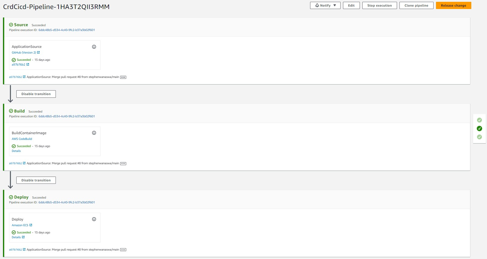

# Week x - Cleanup
This is the cleanup week. WE get our code ready for production deployment

## Sync tool for static website hosting
We first cleanup the our Reactjs error on the front page.
All occurances of ``` ‘==’  ``` to ```‘===’  ```

Once all error are resolved we use a synch tool to build our static website hosting.
we use the s3 sync tool to sync the frontend folder to an S3 bucket and then invalidate the cloudFront cache

[AWS S3 Website sync](https://github.com/teacherseat/aws-s3-website-sync)
This is installed by

```gem install aws_s3_website_sync dotenv  ```

This is the script used to run it

``` 
#!/usr/bin/env ruby

require 'aws_s3_website_sync'
require 'dotenv'

env_path = "/workspace/aws-bootcamp-cruddur-2023/sync.env"
Dotenv.load(env_path)

puts "== configuration"
puts "aws_default_region:   #{ENV["AWS_DEFAULT_REGION"]}"
puts "s3_bucket:            #{ENV["SYNC_S3_BUCKET"]}"
puts "distribution_id:      #{ENV["SYNC_CLOUDFRONT_DISTRUBTION_ID"]}"
puts "build_dir:            #{ENV["SYNC_BUILD_DIR"]}"

changeset_path = ENV["SYNC_OUTPUT_CHANGESET_PATH"]
changeset_path = changeset_path.sub(".json","-#{Time.now.to_i}.json")

puts "output_changset_path: #{changeset_path}"
puts "auto_approve:         #{ENV["SYNC_AUTO_APPROVE"]}"

puts "sync =="
AwsS3WebsiteSync::Runner.run(
  aws_access_key_id:     ENV["AWS_ACCESS_KEY_ID"],
  aws_secret_access_key: ENV["AWS_SECRET_ACCESS_KEY"],
  aws_default_region:    ENV["AWS_DEFAULT_REGION"],
  s3_bucket:             ENV["SYNC_S3_BUCKET"],
  distribution_id:       ENV["SYNC_CLOUDFRONT_DISTRUBTION_ID"],
  build_dir:             ENV["SYNC_BUILD_DIR"],
  output_changset_path:  changeset_path,
  auto_approve:          ENV["SYNC_AUTO_APPROVE"],
  silent: "ignore,no_change",
  ignore_files: [
    'stylesheets/index',
    'android-chrome-192x192.png',
    'android-chrome-256x256.png',
    'apple-touch-icon-precomposed.png',
    'apple-touch-icon.png',
    'site.webmanifest',
    'error.html',
    'favicon-16x16.png',
    'favicon-32x32.png',
    'favicon.ico',
    'robots.txt',
    'safari-pinned-tab.svg'
  ]
)

```


## Reconnect DB and Postgres Confirmation Lamba	

We also need to reconnect our production DB. This is done by configuring the updated Database URL and updating the Security group for the new RDS. Then perform a schema load and run migrations on the production DB

For the lambda we update the Environmental variables for the post confirmation lambda to use new Database connection.
## Ensure CI/CD pipeline works and create activity works	
We then push our code to the prod branch to test our the CI/CD pipeline


## Refactor App.py	

## Refactor Flask Routes
## Implement Replies for Posts	1
## Improved Error Handling for the app	
##  Activities Show Page	
## More General Cleanup Part 1 and Part 2