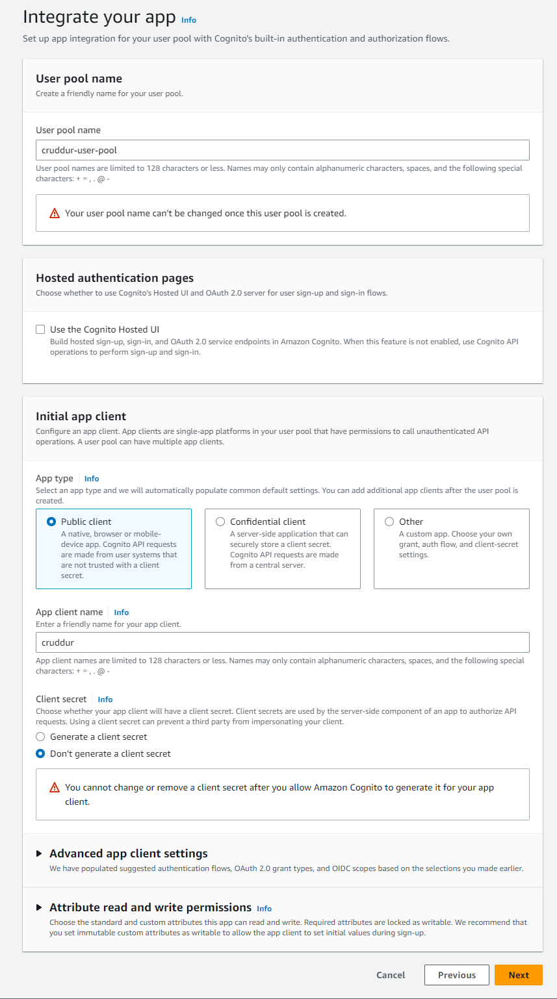

# Week 3 — Decentralized Authentication

## Homework Tasks
### 1. Provision via ClickOps(Using AWS UI) a Amazon Cognito User Pool
First login in to the [AWS Website](https://signin.aws.amazon.com/) then search for Cognito on the search bar.
Select create User pool. By default it select the cognit user pool which we are going to use.

#### Step 1 Configure Sign-in Experience
Select the email option from the cognito user pool sign-in options. You can read more about the options by selecting the info options.


#### Step 2 Configure security requirements
Password policy. We define the length and complexity of the users password.
We leave the password option as the cognito defaults and for now select no MFA(This will be setup later). User account recovery we enable Self-service account recovery and email as the delivery option.


#### Step 3 Configure sign-up experience
We leave all the default options. Then add the name preffered_username on the required attribute


#### Step 4 Configure message delivery
Select Send email with cognito and leave the default From email.


#### Step 5 Integrate your app
We give the pool a name. In our case Cruddur-user-pool. Uncheck Cognito Hosted UI. App type we select public client and Cruddur on the app client name. Select Don't generate a client secret. Proceed next and review and create the pool.


### 2. Install and configure Amplify client-side library for Amazon Congito
Amazon Amplyfy 

Installing AWS Amplify Library
We go into our fontend directory and run the command below to install the library

```
npm i aws-amplify --save
```

Configuring Amplify
We configure amplify on our ```app.js```

``` 
import { Amplify } from 'aws-amplify';

Amplify.configure({
  "AWS_PROJECT_REGION": process.env.REACT_APP_AWS_PROJECT_REGION,
  "aws_cognito_identity_pool_id": process.env.REACT_APP_AWS_COGNITO_IDENTITY_POOL_ID,
  "aws_cognito_region": process.env.REACT_APP_AWS_COGNITO_REGION,
  "aws_user_pools_id": process.env.REACT_APP_AWS_USER_POOLS_ID,
  "aws_user_pools_web_client_id": process.env.REACT_APP_CLIENT_ID,
  "oauth": {},
  Auth: {
    // We are not using an Identity Pool
    // identityPoolId: process.env.REACT_APP_IDENTITY_POOL_ID, // REQUIRED - Amazon Cognito Identity Pool ID
    region: process.env.REACT_APP_AWS_PROJECT_REGION,           // REQUIRED - Amazon Cognito Region
    userPoolId: process.env.REACT_APP_AWS_USER_POOLS_ID,         // OPTIONAL - Amazon Cognito User Pool ID
    userPoolWebClientId: process.env.REACT_APP_CLIENT_ID,   // OPTIONAL - Amazon Cognito Web Client ID (26-char alphanumeric string)
  }
});
```


Then add the variable on docker compose

```
REACT_AWS_PROJECT_REGION: "${AWS_DEFAULT_REGION}"
REACT_APP_AWS_COGNITO_REGION: "${AWS_DEFAULT_REGION}"
REACT_APP_AWS_USER_POOLS_ID: "{user pool id from cognito}"
REACT_APP_CLIENT_ID: "{Client id from cognito}"
```

### 3. Implement API calls to Amazon Coginto for custom login, signup, recovery and forgot password page

Next we configure our front end pages.
On the ```HomeFeedPage.js```  we configure a conditional display of componenct based on use status either logged in or logged out.

This is achieved by the code below
``` 
import { Auth } from 'aws-amplify';

// set a state
const [user, setUser] = React.useState(null);

// check if we are authenicated
const checkAuth = async () => {
  Auth.currentAuthenticatedUser({
    // Optional, By default is false. 
    // If set to true, this call will send a 
    // request to Cognito to get the latest user data
    bypassCache: false 
  })
  .then((user) => {
    console.log('user',user);
    return Auth.currentAuthenticatedUser()
  }).then((cognito_user) => {
      setUser({
        display_name: cognito_user.attributes.name,
        handle: cognito_user.attributes.preferred_username
      })
  })
  .catch((err) => console.log(err));
};

// check when the page loads if we are authenicated
React.useEffect(()=>{
  loadData();
  checkAuth();
}, [])
```

We also add a header to pass along the access token

```
headers: {
    Authorization: `Bearer ${localStorage.getItem("access_token")}`
  }
```

Once this is done we also modify our ```ProfileInfo.js```
```
import { Auth } from 'aws-amplify';

const signOut = async () => {
  try {
      await Auth.signOut({ global: true });
      window.location.href = "/"
  } catch (error) {
      console.log('error signing out: ', error);
  }
}
```

We also rewrite the ```DesktopSidebar.js``` so that it also conditionally displays components depending on a user logged in or out
```
import './DesktopSidebar.css';
import Search from '../components/Search';
import TrendingSection from '../components/TrendingsSection'
import SuggestedUsersSection from '../components/SuggestedUsersSection'
import JoinSection from '../components/JoinSection'

export default function DesktopSidebar(props) {
  const trendings = [
    {"hashtag": "100DaysOfCloud", "count": 2053 },
    {"hashtag": "CloudProject", "count": 8253 },
    {"hashtag": "AWS", "count": 9053 },
    {"hashtag": "FreeWillyReboot", "count": 7753 }
  ]

  const users = [
    {"display_name": "Andrew Brown", "handle": "andrewbrown"}
  ]

  let trending;
  if (props.user) {
    trending = <TrendingSection trendings={trendings} />
  }

  let suggested;
  if (props.user) {
    suggested = <SuggestedUsersSection users={users} />
  }
  let join;
  if (props.user) {
  } else {
    join = <JoinSection />
  }

  return (
    <section>
      <Search />
      {trending}
      {suggested}
      {join}
      <footer>
        <a href="#">About</a>
        <a href="#">Terms of Service</a>
        <a href="#">Privacy Policy</a>
      </footer>
    </section>
  );
}
```

On our sign in page we modify it using the code below.

```
import { Auth } from 'aws-amplify';

const [cognitoErrors, setCognitoErrors] = React.useState('');

const onsubmit = async (event) => {
  setCognitoErrors('')
  event.preventDefault();
  try {
    Auth.signIn(username, password)
      .then(user => {
        localStorage.setItem("access_token", user.signInUserSession.accessToken.jwtToken)
        window.location.href = "/"
      })
      .catch(err => { console.log('Error!', err) });
  } catch (error) {
    if (error.code == 'UserNotConfirmedException') {
      window.location.href = "/confirm"
    }
    setCognitoErrors(error.message)
  }
  return false
}

let errors;
if (cognitoErrors){
  errors = <div className='errors'>{cognitoErrors}</div>;
}

// just before submit component
{errors}
```

Signup page
```
import { Auth } from 'aws-amplify';

const [cognitoErrors, setCognitoErrors] = React.useState('');

const onsubmit = async (event) => {
  event.preventDefault();
  setCognitoErrors('')
  try {
      const { user } = await Auth.signUp({
        username: email,
        password: password,
        attributes: {
            name: name,
            email: email,
            preferred_username: username,
        },
        autoSignIn: { // optional - enables auto sign in after user is confirmed
            enabled: true,
        }
      });
      console.log(user);
      window.location.href = `/confirm?email=${email}`
  } catch (error) {
      console.log(error);
      setCognitoErrors(error.message)
  }
  return false
}

let errors;
if (cognitoErrors){
  errors = <div className='errors'>{cognitoErrors}</div>;
}

//before submit component
{errors}
```

Confirmation Page
```
const resend_code = async (event) => {
  setCognitoErrors('')
  try {
    await Auth.resendSignUp(email);
    console.log('code resent successfully');
    setCodeSent(true)
  } catch (err) {
    // does not return a code
    // does cognito always return english
    // for this to be an okay match?
    console.log(err)
    if (err.message == 'Username cannot be empty'){
      setCognitoErrors("You need to provide an email in order to send Resend Activiation Code")   
    } else if (err.message == "Username/client id combination not found."){
      setCognitoErrors("Email is invalid or cannot be found.")   
    }
  }
}

const onsubmit = async (event) => {
  event.preventDefault();
  setCognitoErrors('')
  try {
    await Auth.confirmSignUp(email, code);
    window.location.href = "/"
  } catch (error) {
    setCognitoErrors(error.message)
  }
  return false
}
```

Recovery page

```
import { Auth } from 'aws-amplify';

const onsubmit_send_code = async (event) => {
  event.preventDefault();
  setCognitoErrors('')
  Auth.forgotPassword(username)
  .then((data) => setFormState('confirm_code') )
  .catch((err) => setCognitoErrors(err.message) );
  return false
}

const onsubmit_confirm_code = async (event) => {
  event.preventDefault();
  setCognitoErrors('')
  if (password == passwordAgain){
    Auth.forgotPasswordSubmit(username, code, password)
    .then((data) => setFormState('success'))
    .catch((err) => setCognitoErrors(err.message) );
  } else {
    setCognitoErrors('Passwords do not match')
  }
  return false
}
```

### 5. Verify JWT Token server side to serve authenticated API endpoints in Flask Application
##### Authenticating Server Side

Add in the ```HomeFeedPage.js``` a header to pass along the access token
```
  headers: {
    Authorization: `Bearer ${localStorage.getItem("access_token")}`
  }
```

In the ```app.py```

cors = CORS(
  app, 
  resources={r"/api/*": {"origins": origins}},
  headers=['Content-Type', 'Authorization'], 
  expose_headers='Authorization',
  methods="OPTIONS,GET,HEAD,POST"
)

We then configure token validation

On our backend we add service objects on our the lib folder
[Cognito JWT Token](/backend-flask/lib/cognito_jwt_token.py)


Then add ```Flask-AWSCognito``` on our requirements.txt


We also update our docker compose backend-flask environment as below

```
 AWS_COGNITO_USER_POOL_ID: "us-east-1_ks7bIEUuu"
 AWS_COGNITO_USER_POOL_CLIENT_ID: "5747ng4l9dua3biio3n7cs94hg"
```

Then configure our backend-flask 

```
cognito_jwt_token = CognitoJwtToken(
  user_pool_id=os.getenv("AWS_COGNITO_USER_POOL_ID"), 
  user_pool_client_id=os.getenv("AWS_COGNITO_USER_POOL_CLIENT_ID"),
  region=os.getenv("AWS_DEFAULT_REGION")
)
```

we update our activities/home with the code below

``` 
@app.route("/api/activities/home", methods=['GET'])
def data_home():
  access_token = extract_access_token(request.headers)
  try:
    claims = cognito_jwt_token.verify(access_token)
    # authenicatied request
    app.logger.debug("authenicated")
    app.logger.debug(claims)
    app.logger.debug(claims['username'])
    data = HomeActivities.run(cognito_user_id=claims['username'])
  except TokenVerifyError as e:
    # unauthenicatied request
    app.logger.debug(e)
    app.logger.debug("unauthenicated")
    data = HomeActivities.run()
  return data, 200
```


## Homework Challenge WIP
1. Implement a IdP login eg. Login with Amazon or Facebook or Apple.
5. Implement MFA that send an SMS (text message), warning this has spend, investigate spend before considering, text messages are not eligible for AWS Credits
